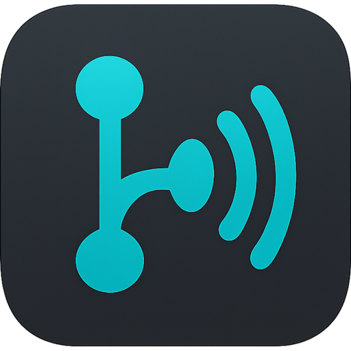

<a name="top"></a>

<div align="center">
  
  <h1>GitChorus</h1>
  <p><strong>AI-powered code review and issue validation for your repositories</strong></p>

[](https://github.com/Shironex/gitchorus/releases/latest)
[](https://github.com/Shironex/gitchorus/releases/latest)
[](https://www.electronjs.org/)
[](https://react.dev/)
[](https://nestjs.com/)
[](https://www.typescriptlang.org/)
[](https://github.com/Shironex/gitchorus)
[](LICENSE)

**[Download Latest Release](https://github.com/Shironex/gitchorus/releases/latest)** | [macOS](https://github.com/Shironex/gitchorus/releases/latest) | [Windows](https://github.com/Shironex/gitchorus/releases/latest) | [Linux](https://github.com/Shironex/gitchorus/releases/latest)

</div>

## Table of Contents

- [About](#about)
- [Features](#features)
- [How It Works](#how-it-works)
- [Requirements](#requirements)
- [Quick Start](#quick-start)
- [Development](#development)
- [Architecture](#architecture)
- [Tech Stack](#tech-stack)
- [Contributing](#contributing)
- [License](#license)

## About

GitChorus is a desktop application that brings AI-powered code analysis directly to your local repositories. Point it at any GitHub-connected git repo and get structured, evidence-backed issue validation and PR reviews — powered by Claude's AI, running through your existing CLI subscription with zero API keys needed.

Unlike generic AI chat tools, GitChorus actually reads your codebase. The AI agent navigates your project files, understands your architecture, and produces findings backed by real code references — not hallucinated guesses.

## Features

| Feature                  | Description                                                                                               |
| ------------------------ | --------------------------------------------------------------------------------------------------------- |
| **Issue Validation**     | AI agent reads your codebase to validate bug reports and assess feature requests with structured analysis |
| **PR Code Review**       | Comprehensive review with severity-categorized findings, code evidence, and suggested fixes               |
| **Streaming Progress**   | Watch the AI agent work in real-time — see which files it reads, which tools it uses                      |
| **GitHub Integration**   | Push validation summaries and review findings to GitHub with one click (inline PR comments included)      |
| **Review History**       | All validation and review results are persisted locally and survive app restarts                          |
| **Dashboard**            | Overview of open issues, PRs, quality score trends, and recent activity                                   |
| **Provider Abstraction** | Claude SDK as default provider, with architecture ready for Codex, Gemini, and other CLI-based providers  |
| **Configurable**         | Choose your model, review depth, default review action, and more from project settings                    |
| **Dark/Light Themes**    | Multiple theme options with syntax-highlighted code blocks via shiki                                      |
| **Cross-Platform**       | Native support for macOS, Windows, and Linux via Electron                                                 |
| **Auto-Updates**         | Built-in update detection and in-app installation                                                         |

## How It Works

### Issue Validation

1. Open a local git repository with a GitHub remote
2. Browse open issues from the connected repository
3. Click **Validate** on any issue — the AI agent spawns in read-only mode
4. Watch streaming progress as it analyzes your codebase
5. Get structured results: verdict, confidence, affected files, complexity, suggested approach
6. Push the analysis to GitHub as an issue comment with one click

### PR Review

1. Switch to the Pull Requests tab and select a PR
2. Click **Start Review** — the AI analyzes the diff with full codebase context
3. Get findings grouped by severity (Critical, Major, Minor, Nit) with:
   - Exact file and line references
   - Code snippets showing the problem
   - Suggested fixes
   - Category tags (security, logic, performance, style, codebase-fit)
4. Select findings and push as a proper GitHub PR review with inline comments

## Requirements

- **Node.js** >= 22.0.0
- **pnpm** >= 9.0.0
- **Claude CLI** — GitChorus uses your existing Claude CLI subscription (no API keys)
  - Install: `npm install -g @anthropic-ai/claude-code`
  - Authenticate: `claude` (follow the prompts)

## Quick Start

```bash
# Clone the repository
git clone https://github.com/Shironex/gitchorus.git
cd gitchorus

# Install dependencies
pnpm install

# Start development
pnpm dev

# Build for production
pnpm build

# Package for distribution
pnpm package          # Current platform
pnpm package:win      # Windows
pnpm package:mac      # macOS
pnpm package:linux    # Linux
```

## Development

```bash
# Run tests
pnpm test

# Run tests with coverage
pnpm test:cov

# Type checking
pnpm typecheck

# Lint code
pnpm lint

# Format code
pnpm format

# Check formatting
pnpm format:check

# Run with debug logging
pnpm dev:debug
```

## Architecture

```
gitchorus/
├── apps/
│   ├── desktop/       # Electron + NestJS backend
│   └── web/           # React frontend
└── packages/
    └── shared/        # Shared types, constants, utilities
```

**Communication Flow:**

```
┌─────────────────────────────────────┐
│       Electron Main Process         │
│  ┌───────────────────────────────┐  │
│  │       NestJS Backend          │  │
│  │  Git │ GitHub │ Provider      │  │
│  │  Validation │ Review │ Settings│ │
│  └───────────────────────────────┘  │
│              │ WebSocket            │
└──────────────┼──────────────────────┘
               │
┌──────────────┼──────────────────────┐
│       Electron Renderer             │
│  ┌───────────────────────────────┐  │
│  │     React + Zustand           │  │
│  │  Dashboard │ Issues │ PRs     │  │
│  │  Settings  │ Review │ History │  │
│  └───────────────────────────────┘  │
└─────────────────────────────────────┘
```

**Key Design Decisions:**

- **No API keys** — Uses Claude CLI subscription via the Claude Agent SDK, so there's nothing to configure
- **Read-only analysis** — The AI agent never writes code or makes changes, only reads and analyzes
- **Evidence-backed** — Every finding includes actual code references, not generic advice
- **Local-first** — All history and settings stored locally via electron-store
- **Dynamic ports** — The NestJS backend binds to an OS-assigned port at startup, avoiding conflicts with other applications

## Tech Stack

| Layer       | Technology                                 |
| ----------- | ------------------------------------------ |
| Desktop     | Electron 40                                |
| Backend     | NestJS 10, EventEmitter2                   |
| Frontend    | React 18, Zustand 5                        |
| AI Provider | Claude Agent SDK                           |
| Styling     | Tailwind CSS 4                             |
| Markdown    | ReactMarkdown, shiki (syntax highlighting) |
| Charts      | Recharts                                   |
| Build       | Vite, esbuild                              |
| IPC         | Socket.io                                  |
| Persistence | electron-store                             |

## Contributing

Contributions are welcome! Feel free to:

- [Submit an issue](https://github.com/Shironex/gitchorus/issues) for bugs or feature requests
- Open a pull request with improvements
- Share feedback and suggestions

## License

This project is licensed under a custom license — free to use, but you may not resell or redistribute it. See the [LICENSE](LICENSE) file for details.

---

[Back to top](#top)
